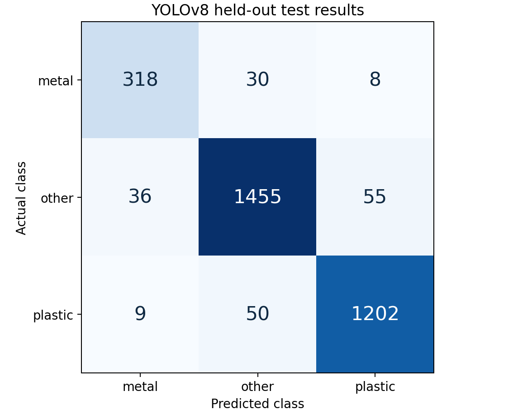
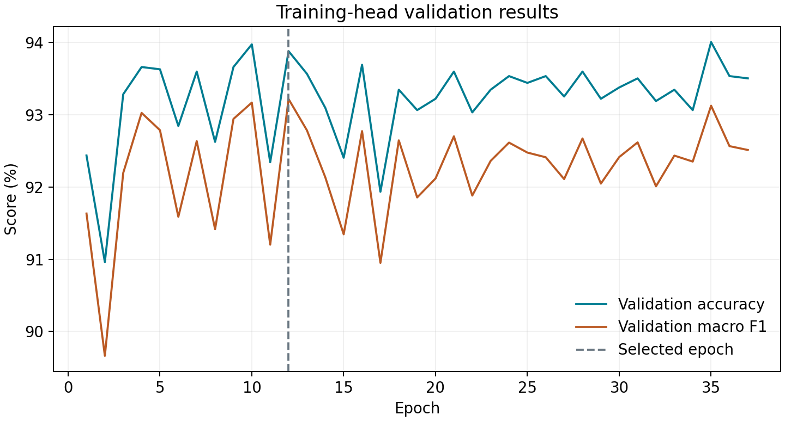

# Waste YOLOv8 — completed model report

Built on 2026-09-20. Model: **YOLOv8n-cls**, trained on CPU with three image-level classes.

## Measured result

**Test top-1 accuracy: 94.06%** on **3,163 held-out images/crops**.
Test macro F1: **0.9269**. A 2,000-resample group bootstrap gives an approximate
95% accuracy interval of **92.90%–95.21%** within this curated dataset.
This does not measure accuracy on a new camera, new physical items, or a different location.

| Class | Precision | Recall | F1 | Test images |
| --- | ---: | ---: | ---: | ---: |
| metal | 0.876 | 0.893 | 0.885 | 356 |
| other | 0.948 | 0.941 | 0.944 | 1546 |
| plastic | 0.950 | 0.953 | 0.952 | 1261 |

## Source-specific test accuracy

| Source | Test images | Accuracy |
| --- | ---: | ---: |
| garbage_v12 | 1839 | 92.28% |
| uploaded | 434 | 99.77% |
| wastesnap_v2 | 114 | 85.09% |
| wild_bottles | 776 | 96.39% |

The mixed overall accuracy weights sources by their retained test image counts.
The wild-bottle source contains only the plastic class. Its accuracy cannot measure
false positives on nonplastic objects. Per-source results may differ substantially.

## Data and split

| Split | Metal | Other | Plastic |
| --- | ---: | ---: | ---: |
| train | 2203 | 7214 | 6274 |
| val | 455 | 1546 | 1185 |
| test | 356 | 1546 | 1261 |

Total retained images/crops: 22,040. Exact duplicates removed: 17.
There are zero shared exact pixel hashes or prepared groups across the three splits.
The split was rebuilt with 70/15/15 target proportions and grouping, so it is not an
official benchmark split. Uploaded adjacent filename blocks, source image names,
and perceptually similar images are grouped. That heuristic does not guarantee
independent physical objects or photographic sessions.

The water-level dataset was inspected and excluded because its class labels do
not establish material. The three compatible Kaggle sources and the user upload
contributed images. See `DATA_SOURCES.md` for exact mappings and attributions.

## Training method

- ImageNet-pretrained YOLOv8n-cls backbone: frozen.
- Trained component: the final 1280-to-3 linear layer (3,843 parameters).
- Training images: 15,691; original plus horizontal-flipped views.
- Features: 31,382; feature dropout 0.15.
- Loss: class-weighted cross entropy with label smoothing 0.02.
- Optimizer: AdamW; seed 42; selected by validation macro F1.
- Epochs completed: 37; selected epoch: 12.
- Validation accuracy at selection: 93.88%.
- Test images were not used for training or checkpoint selection.
- Input: RGB, full-image aspect-preserving padding to 224, divide by 255.
- Runtime: torch 2.8.0+cpu, ultralytics 8.3.253.

This is a completed transfer-learning baseline. End-to-end fine-tuning is an
optional supplied recipe, not a step claimed to have been completed here.

## Prediction thresholds

The predictor reports `uncertain` below score 0.80 or probability margin 0.15.
These default thresholds were not calibrated. On this test set they retain
85.96% of images and have
98.31% top-1 accuracy among the retained images.
Neither the score nor the `other` class guarantees rejection of unfamiliar inputs.

## Verification

The saved PyTorch checkpoint was loaded and evaluated on the test set. The
ONNX structure passed validation. On 9 representative validation images,
ONNX and PyTorch predicted the same top class; the largest absolute probability
difference was 0.00000069.
Scripts passed Python syntax compilation. The Colab notebook was structurally
checked but was not run in Colab, and the optional GPU fine-tuning path was not
executed in this CPU build.

## Scope

The model classifies a whole photo/crop as metal, plastic, or other. It does not
produce detection boxes, reliably count items, verify PET type, determine empty
bottles, or decide reward eligibility. No real camera or machine integration was
tested. Preserve the included preprocessing and test actual camera images before
depending on its classifications.
